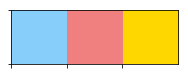
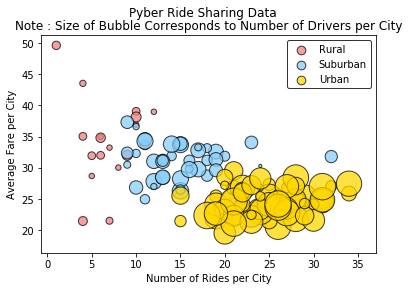
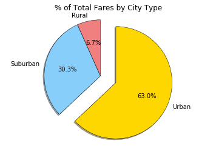
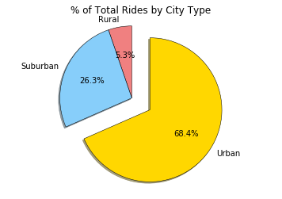
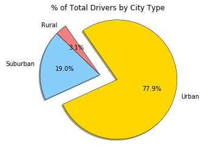

```python
#Dependencies
import pandas as pd
import numpy as np
import matplotlib.pyplot as plt
import seaborn as sns
```


```python
#Import file using pandas
cdfile = "city_data.csv"
rdfile = "ride_data.csv"
```


```python
cd_df = pd.read_csv(cdfile)
rd_df = pd.read_csv(rdfile)
cd_df.head(10)
```


<div>
<style>
    .dataframe thead tr:only-child th {
        text-align: right;
    }

    .dataframe thead th {
        text-align: left;
    }

    .dataframe tbody tr th {
        vertical-align: top;
    }
</style>
<table border="1" class="dataframe">
  <thead>
    <tr style="text-align: right;">
      <th></th>
      <th>city</th>
      <th>driver_count</th>
      <th>type</th>
    </tr>
  </thead>
  <tbody>
    <tr>
      <th>0</th>
      <td>Kelseyland</td>
      <td>63</td>
      <td>Urban</td>
    </tr>
    <tr>
      <th>1</th>
      <td>Nguyenbury</td>
      <td>8</td>
      <td>Urban</td>
    </tr>
    <tr>
      <th>2</th>
      <td>East Douglas</td>
      <td>12</td>
      <td>Urban</td>
    </tr>
    <tr>
      <th>3</th>
      <td>West Dawnfurt</td>
      <td>34</td>
      <td>Urban</td>
    </tr>
    <tr>
      <th>4</th>
      <td>Rodriguezburgh</td>
      <td>52</td>
      <td>Urban</td>
    </tr>
    <tr>
      <th>5</th>
      <td>South Josephville</td>
      <td>4</td>
      <td>Urban</td>
    </tr>
    <tr>
      <th>6</th>
      <td>West Sydneyhaven</td>
      <td>70</td>
      <td>Urban</td>
    </tr>
    <tr>
      <th>7</th>
      <td>Travisville</td>
      <td>37</td>
      <td>Urban</td>
    </tr>
    <tr>
      <th>8</th>
      <td>Torresshire</td>
      <td>70</td>
      <td>Urban</td>
    </tr>
    <tr>
      <th>9</th>
      <td>Lisaville</td>
      <td>66</td>
      <td>Urban</td>
    </tr>
  </tbody>
</table>
</div>


```python
rd_df.head(10)
```


<div>
<style>
    .dataframe thead tr:only-child th {
        text-align: right;
    }

    .dataframe thead th {
        text-align: left;
    }

    .dataframe tbody tr th {
        vertical-align: top;
    }
</style>
<table border="1" class="dataframe">
  <thead>
    <tr style="text-align: right;">
      <th></th>
      <th>city</th>
      <th>date</th>
      <th>fare</th>
      <th>ride_id</th>
    </tr>
  </thead>
  <tbody>
    <tr>
      <th>0</th>
      <td>Sarabury</td>
      <td>2016-01-16 13:49:27</td>
      <td>38.35</td>
      <td>5403689035038</td>
    </tr>
    <tr>
      <th>1</th>
      <td>South Roy</td>
      <td>2016-01-02 18:42:34</td>
      <td>17.49</td>
      <td>4036272335942</td>
    </tr>
    <tr>
      <th>2</th>
      <td>Wiseborough</td>
      <td>2016-01-21 17:35:29</td>
      <td>44.18</td>
      <td>3645042422587</td>
    </tr>
    <tr>
      <th>3</th>
      <td>Spencertown</td>
      <td>2016-07-31 14:53:22</td>
      <td>6.87</td>
      <td>2242596575892</td>
    </tr>
    <tr>
      <th>4</th>
      <td>Nguyenbury</td>
      <td>2016-07-09 04:42:44</td>
      <td>6.28</td>
      <td>1543057793673</td>
    </tr>
    <tr>
      <th>5</th>
      <td>New Jeffrey</td>
      <td>2016-02-22 18:36:25</td>
      <td>36.01</td>
      <td>9757888452346</td>
    </tr>
    <tr>
      <th>6</th>
      <td>Port Johnstad</td>
      <td>2016-06-07 02:39:58</td>
      <td>17.15</td>
      <td>4352278259335</td>
    </tr>
    <tr>
      <th>7</th>
      <td>Jacobfort</td>
      <td>2016-09-20 20:58:37</td>
      <td>22.98</td>
      <td>1500221409082</td>
    </tr>
    <tr>
      <th>8</th>
      <td>Travisville</td>
      <td>2016-01-15 17:32:02</td>
      <td>27.39</td>
      <td>850152768361</td>
    </tr>
    <tr>
      <th>9</th>
      <td>Sandymouth</td>
      <td>2016-11-16 07:27:00</td>
      <td>21.61</td>
      <td>2389035050524</td>
    </tr>
  </tbody>
</table>
</div>


```python
#Droping record with same city name and ride ids
cd_df = cd_df.drop_duplicates("city", keep = "first")
cd_df.head(10)
```


<div>
<style>
    .dataframe thead tr:only-child th {
        text-align: right;
    }

    .dataframe thead th {
        text-align: left;
    }

    .dataframe tbody tr th {
        vertical-align: top;
    }
</style>
<table border="1" class="dataframe">
  <thead>
    <tr style="text-align: right;">
      <th></th>
      <th>city</th>
      <th>driver_count</th>
      <th>type</th>
    </tr>
  </thead>
  <tbody>
    <tr>
      <th>0</th>
      <td>Kelseyland</td>
      <td>63</td>
      <td>Urban</td>
    </tr>
    <tr>
      <th>1</th>
      <td>Nguyenbury</td>
      <td>8</td>
      <td>Urban</td>
    </tr>
    <tr>
      <th>2</th>
      <td>East Douglas</td>
      <td>12</td>
      <td>Urban</td>
    </tr>
    <tr>
      <th>3</th>
      <td>West Dawnfurt</td>
      <td>34</td>
      <td>Urban</td>
    </tr>
    <tr>
      <th>4</th>
      <td>Rodriguezburgh</td>
      <td>52</td>
      <td>Urban</td>
    </tr>
    <tr>
      <th>5</th>
      <td>South Josephville</td>
      <td>4</td>
      <td>Urban</td>
    </tr>
    <tr>
      <th>6</th>
      <td>West Sydneyhaven</td>
      <td>70</td>
      <td>Urban</td>
    </tr>
    <tr>
      <th>7</th>
      <td>Travisville</td>
      <td>37</td>
      <td>Urban</td>
    </tr>
    <tr>
      <th>8</th>
      <td>Torresshire</td>
      <td>70</td>
      <td>Urban</td>
    </tr>
    <tr>
      <th>9</th>
      <td>Lisaville</td>
      <td>66</td>
      <td>Urban</td>
    </tr>
  </tbody>
</table>
</div>


```python
#merging
merge_df = cd_df.merge(rd_df, on = "city")
merge_df
```


<div>
<style>
    .dataframe thead tr:only-child th {
        text-align: right;
    }

    .dataframe thead th {
        text-align: left;
    }

    .dataframe tbody tr th {
        vertical-align: top;
    }
</style>
<table border="1" class="dataframe">
  <thead>
    <tr style="text-align: right;">
      <th></th>
      <th>city</th>
      <th>driver_count</th>
      <th>type</th>
      <th>date</th>
      <th>fare</th>
      <th>ride_id</th>
    </tr>
  </thead>
  <tbody>
    <tr>
      <th>0</th>
      <td>Kelseyland</td>
      <td>63</td>
      <td>Urban</td>
      <td>2016-08-19 04:27:52</td>
      <td>5.51</td>
      <td>6246006544795</td>
    </tr>
    <tr>
      <th>1</th>
      <td>Kelseyland</td>
      <td>63</td>
      <td>Urban</td>
      <td>2016-04-17 06:59:50</td>
      <td>5.54</td>
      <td>7466473222333</td>
    </tr>
    <tr>
      <th>2</th>
      <td>Kelseyland</td>
      <td>63</td>
      <td>Urban</td>
      <td>2016-05-04 15:06:07</td>
      <td>30.54</td>
      <td>2140501382736</td>
    </tr>
    <tr>
      <th>3</th>
      <td>Kelseyland</td>
      <td>63</td>
      <td>Urban</td>
      <td>2016-01-25 20:44:56</td>
      <td>12.08</td>
      <td>1896987891309</td>
    </tr>
    <tr>
      <th>4</th>
      <td>Kelseyland</td>
      <td>63</td>
      <td>Urban</td>
      <td>2016-08-09 18:19:47</td>
      <td>17.91</td>
      <td>8784212854829</td>
    </tr>
    <tr>
      <th>5</th>
      <td>Kelseyland</td>
      <td>63</td>
      <td>Urban</td>
      <td>2016-10-24 15:15:46</td>
      <td>33.56</td>
      <td>4797969661996</td>
    </tr>
    <tr>
      <th>6</th>
      <td>Kelseyland</td>
      <td>63</td>
      <td>Urban</td>
      <td>2016-06-06 13:54:23</td>
      <td>20.81</td>
      <td>9811478565448</td>
    </tr>
    <tr>
      <th>7</th>
      <td>Kelseyland</td>
      <td>63</td>
      <td>Urban</td>
      <td>2016-08-10 07:02:40</td>
      <td>44.53</td>
      <td>1563171128434</td>
    </tr>
    <tr>
      <th>8</th>
      <td>Kelseyland</td>
      <td>63</td>
      <td>Urban</td>
      <td>2016-07-05 17:37:13</td>
      <td>29.02</td>
      <td>6897992353955</td>
    </tr>
    <tr>
      <th>9</th>
      <td>Kelseyland</td>
      <td>63</td>
      <td>Urban</td>
      <td>2016-04-25 02:18:31</td>
      <td>20.05</td>
      <td>1148374505062</td>
    </tr>
    <tr>
      <th>10</th>
      <td>Kelseyland</td>
      <td>63</td>
      <td>Urban</td>
      <td>2016-01-25 08:47:09</td>
      <td>9.29</td>
      <td>213692794373</td>
    </tr>
    <tr>
      <th>11</th>
      <td>Kelseyland</td>
      <td>63</td>
      <td>Urban</td>
      <td>2016-11-10 01:57:14</td>
      <td>20.58</td>
      <td>3395682132130</td>
    </tr>
    <tr>
      <th>12</th>
      <td>Kelseyland</td>
      <td>63</td>
      <td>Urban</td>
      <td>2016-08-15 11:55:02</td>
      <td>27.45</td>
      <td>8456148871668</td>
    </tr>
    <tr>
      <th>13</th>
      <td>Kelseyland</td>
      <td>63</td>
      <td>Urban</td>
      <td>2016-08-01 10:51:49</td>
      <td>33.51</td>
      <td>6610565660737</td>
    </tr>
    <tr>
      <th>14</th>
      <td>Kelseyland</td>
      <td>63</td>
      <td>Urban</td>
      <td>2016-04-13 12:07:08</td>
      <td>6.56</td>
      <td>8101498434215</td>
    </tr>
    <tr>
      <th>15</th>
      <td>Kelseyland</td>
      <td>63</td>
      <td>Urban</td>
      <td>2016-01-12 22:51:21</td>
      <td>20.19</td>
      <td>3054122642867</td>
    </tr>
    <tr>
      <th>16</th>
      <td>Kelseyland</td>
      <td>63</td>
      <td>Urban</td>
      <td>2016-05-31 01:05:31</td>
      <td>35.22</td>
      <td>5946467060438</td>
    </tr>
    <tr>
      <th>17</th>
      <td>Kelseyland</td>
      <td>63</td>
      <td>Urban</td>
      <td>2016-07-13 16:53:07</td>
      <td>10.31</td>
      <td>2180910323678</td>
    </tr>
    <tr>
      <th>18</th>
      <td>Kelseyland</td>
      <td>63</td>
      <td>Urban</td>
      <td>2016-01-07 07:15:41</td>
      <td>11.45</td>
      <td>600800386573</td>
    </tr>
    <tr>
      <th>19</th>
      <td>Kelseyland</td>
      <td>63</td>
      <td>Urban</td>
      <td>2016-04-09 13:17:27</td>
      <td>27.85</td>
      <td>5748868894243</td>
    </tr>
    <tr>
      <th>20</th>
      <td>Kelseyland</td>
      <td>63</td>
      <td>Urban</td>
      <td>2016-06-30 01:59:04</td>
      <td>8.27</td>
      <td>4384089549855</td>
    </tr>
    <tr>
      <th>21</th>
      <td>Kelseyland</td>
      <td>63</td>
      <td>Urban</td>
      <td>2016-04-20 05:36:59</td>
      <td>31.67</td>
      <td>2865704421982</td>
    </tr>
    <tr>
      <th>22</th>
      <td>Kelseyland</td>
      <td>63</td>
      <td>Urban</td>
      <td>2016-05-02 05:55:28</td>
      <td>40.92</td>
      <td>2769007541388</td>
    </tr>
    <tr>
      <th>23</th>
      <td>Kelseyland</td>
      <td>63</td>
      <td>Urban</td>
      <td>2016-06-22 06:54:57</td>
      <td>12.58</td>
      <td>6629798205387</td>
    </tr>
    <tr>
      <th>24</th>
      <td>Kelseyland</td>
      <td>63</td>
      <td>Urban</td>
      <td>2016-06-18 06:03:03</td>
      <td>16.77</td>
      <td>7223504701591</td>
    </tr>
    <tr>
      <th>25</th>
      <td>Kelseyland</td>
      <td>63</td>
      <td>Urban</td>
      <td>2016-01-09 20:28:56</td>
      <td>27.21</td>
      <td>831362906446</td>
    </tr>
    <tr>
      <th>26</th>
      <td>Kelseyland</td>
      <td>63</td>
      <td>Urban</td>
      <td>2016-07-22 19:28:21</td>
      <td>35.71</td>
      <td>1234880130185</td>
    </tr>
    <tr>
      <th>27</th>
      <td>Kelseyland</td>
      <td>63</td>
      <td>Urban</td>
      <td>2016-11-26 02:34:57</td>
      <td>15.49</td>
      <td>5187807155760</td>
    </tr>
    <tr>
      <th>28</th>
      <td>Nguyenbury</td>
      <td>8</td>
      <td>Urban</td>
      <td>2016-07-09 04:42:44</td>
      <td>6.28</td>
      <td>1543057793673</td>
    </tr>
    <tr>
      <th>29</th>
      <td>Nguyenbury</td>
      <td>8</td>
      <td>Urban</td>
      <td>2016-11-08 19:22:04</td>
      <td>19.49</td>
      <td>1702803950740</td>
    </tr>
    <tr>
      <th>...</th>
      <td>...</td>
      <td>...</td>
      <td>...</td>
      <td>...</td>
      <td>...</td>
      <td>...</td>
    </tr>
    <tr>
      <th>2345</th>
      <td>East Leslie</td>
      <td>9</td>
      <td>Rural</td>
      <td>2016-04-13 04:30:56</td>
      <td>40.47</td>
      <td>7075058703398</td>
    </tr>
    <tr>
      <th>2346</th>
      <td>East Leslie</td>
      <td>9</td>
      <td>Rural</td>
      <td>2016-04-26 02:34:30</td>
      <td>45.80</td>
      <td>9402873395510</td>
    </tr>
    <tr>
      <th>2347</th>
      <td>East Leslie</td>
      <td>9</td>
      <td>Rural</td>
      <td>2016-04-05 18:53:16</td>
      <td>44.78</td>
      <td>6113138249150</td>
    </tr>
    <tr>
      <th>2348</th>
      <td>East Leslie</td>
      <td>9</td>
      <td>Rural</td>
      <td>2016-11-13 10:21:10</td>
      <td>15.71</td>
      <td>7275986542384</td>
    </tr>
    <tr>
      <th>2349</th>
      <td>East Leslie</td>
      <td>9</td>
      <td>Rural</td>
      <td>2016-03-06 06:10:40</td>
      <td>51.32</td>
      <td>6841691147797</td>
    </tr>
    <tr>
      <th>2350</th>
      <td>East Leslie</td>
      <td>9</td>
      <td>Rural</td>
      <td>2016-03-04 10:18:03</td>
      <td>13.43</td>
      <td>8814831098684</td>
    </tr>
    <tr>
      <th>2351</th>
      <td>East Leslie</td>
      <td>9</td>
      <td>Rural</td>
      <td>2016-11-28 09:09:15</td>
      <td>37.76</td>
      <td>804829686137</td>
    </tr>
    <tr>
      <th>2352</th>
      <td>East Leslie</td>
      <td>9</td>
      <td>Rural</td>
      <td>2016-09-08 19:19:38</td>
      <td>30.59</td>
      <td>8211833105097</td>
    </tr>
    <tr>
      <th>2353</th>
      <td>East Leslie</td>
      <td>9</td>
      <td>Rural</td>
      <td>2016-03-02 22:09:34</td>
      <td>36.61</td>
      <td>5500269118478</td>
    </tr>
    <tr>
      <th>2354</th>
      <td>East Leslie</td>
      <td>9</td>
      <td>Rural</td>
      <td>2016-06-22 07:45:30</td>
      <td>34.54</td>
      <td>684950063164</td>
    </tr>
    <tr>
      <th>2355</th>
      <td>Hernandezshire</td>
      <td>10</td>
      <td>Rural</td>
      <td>2016-02-20 08:17:32</td>
      <td>58.95</td>
      <td>3176534714830</td>
    </tr>
    <tr>
      <th>2356</th>
      <td>Hernandezshire</td>
      <td>10</td>
      <td>Rural</td>
      <td>2016-06-26 20:11:50</td>
      <td>28.78</td>
      <td>6382848462030</td>
    </tr>
    <tr>
      <th>2357</th>
      <td>Hernandezshire</td>
      <td>10</td>
      <td>Rural</td>
      <td>2016-01-24 00:21:35</td>
      <td>30.32</td>
      <td>7342649945759</td>
    </tr>
    <tr>
      <th>2358</th>
      <td>Hernandezshire</td>
      <td>10</td>
      <td>Rural</td>
      <td>2016-03-05 10:40:16</td>
      <td>23.35</td>
      <td>7443355895137</td>
    </tr>
    <tr>
      <th>2359</th>
      <td>Hernandezshire</td>
      <td>10</td>
      <td>Rural</td>
      <td>2016-04-11 04:44:50</td>
      <td>10.41</td>
      <td>9823290002445</td>
    </tr>
    <tr>
      <th>2360</th>
      <td>Hernandezshire</td>
      <td>10</td>
      <td>Rural</td>
      <td>2016-06-26 11:16:28</td>
      <td>26.29</td>
      <td>304182959218</td>
    </tr>
    <tr>
      <th>2361</th>
      <td>Hernandezshire</td>
      <td>10</td>
      <td>Rural</td>
      <td>2016-11-25 20:34:14</td>
      <td>38.45</td>
      <td>2898512024847</td>
    </tr>
    <tr>
      <th>2362</th>
      <td>Hernandezshire</td>
      <td>10</td>
      <td>Rural</td>
      <td>2016-11-20 17:32:37</td>
      <td>26.79</td>
      <td>3095402154397</td>
    </tr>
    <tr>
      <th>2363</th>
      <td>Hernandezshire</td>
      <td>10</td>
      <td>Rural</td>
      <td>2016-02-24 17:30:44</td>
      <td>44.68</td>
      <td>6389115653382</td>
    </tr>
    <tr>
      <th>2364</th>
      <td>Horneland</td>
      <td>8</td>
      <td>Rural</td>
      <td>2016-07-19 10:07:33</td>
      <td>12.63</td>
      <td>8214498891817</td>
    </tr>
    <tr>
      <th>2365</th>
      <td>Horneland</td>
      <td>8</td>
      <td>Rural</td>
      <td>2016-03-22 21:22:20</td>
      <td>31.53</td>
      <td>1797785685674</td>
    </tr>
    <tr>
      <th>2366</th>
      <td>Horneland</td>
      <td>8</td>
      <td>Rural</td>
      <td>2016-01-26 09:38:17</td>
      <td>21.73</td>
      <td>5665544449606</td>
    </tr>
    <tr>
      <th>2367</th>
      <td>Horneland</td>
      <td>8</td>
      <td>Rural</td>
      <td>2016-03-25 02:05:42</td>
      <td>20.04</td>
      <td>5729327140644</td>
    </tr>
    <tr>
      <th>2368</th>
      <td>West Kevintown</td>
      <td>5</td>
      <td>Rural</td>
      <td>2016-11-27 20:12:58</td>
      <td>12.92</td>
      <td>6460741616450</td>
    </tr>
    <tr>
      <th>2369</th>
      <td>West Kevintown</td>
      <td>5</td>
      <td>Rural</td>
      <td>2016-02-19 01:42:58</td>
      <td>11.15</td>
      <td>8622534016726</td>
    </tr>
    <tr>
      <th>2370</th>
      <td>West Kevintown</td>
      <td>5</td>
      <td>Rural</td>
      <td>2016-03-11 09:03:43</td>
      <td>42.13</td>
      <td>4568909568268</td>
    </tr>
    <tr>
      <th>2371</th>
      <td>West Kevintown</td>
      <td>5</td>
      <td>Rural</td>
      <td>2016-06-25 08:04:12</td>
      <td>24.53</td>
      <td>8188407925972</td>
    </tr>
    <tr>
      <th>2372</th>
      <td>West Kevintown</td>
      <td>5</td>
      <td>Rural</td>
      <td>2016-07-24 13:41:23</td>
      <td>11.78</td>
      <td>2001192693573</td>
    </tr>
    <tr>
      <th>2373</th>
      <td>West Kevintown</td>
      <td>5</td>
      <td>Rural</td>
      <td>2016-06-15 19:53:16</td>
      <td>13.50</td>
      <td>9577921579881</td>
    </tr>
    <tr>
      <th>2374</th>
      <td>West Kevintown</td>
      <td>5</td>
      <td>Rural</td>
      <td>2016-02-10 00:50:04</td>
      <td>34.69</td>
      <td>9595491362610</td>
    </tr>
  </tbody>
</table>
<p>2375 rows × 6 columns</p>
</div>


```python
#Dictionary color scheme
color_scheme = {'Light Sky Blue':'#87CEFA','Light Coral':'#F08080','Gold':'#FFD700','Light Coral':'#F08080'}
sns.palplot(sns.color_palette(color_scheme.values()))
plt.show()
```





BUBBLE PLOT


```python
#grouping by city name
bycity = merge_df.groupby('city')
bycity
```


    <pandas.core.groupby.DataFrameGroupBy object at 0x1a14cb4470>


```python
#avgerage fare by city
avgfare = bycity.mean()['fare']
avgfare
```


    city
    Alvarezhaven            23.928710
    Alyssaberg              20.609615
    Anitamouth              37.315556
    Antoniomouth            23.625000
    Aprilchester            21.981579
    Arnoldview              25.106452
    Campbellport            33.711333
    Carrollbury             36.606000
    Carrollfort             25.395517
    Clarkstad               31.051667
    Conwaymouth             34.591818
    Davidtown               22.978095
    Davistown               21.497200
    East Cherylfurt         31.416154
    East Douglas            26.169091
    East Erin               24.478214
    East Jenniferchester    32.599474
    East Leslie             33.660909
    East Stephen            39.053000
    East Troybury           33.244286
    Edwardsbury             26.876667
    Erikport                30.043750
    Eriktown                25.478947
    Floresberg              32.310000
    Fosterside              23.034583
    Hernandezshire          32.002222
    Horneland               21.482500
    Jacksonfort             32.006667
    Jacobfort               24.779355
    Jasonfort               27.831667
                              ...    
    South Roy               26.031364
    South Shannonborough    26.516667
    Spencertown             23.681154
    Stevensport             31.948000
    Stewartview             21.614000
    Swansonbury             27.464706
    Thomastown              30.308333
    Tiffanyton              28.510000
    Torresshire             24.207308
    Travisville             27.220870
    Vickimouth              21.474667
    Webstertown             29.721250
    West Alexis             19.523000
    West Brandy             24.157667
    West Brittanyton        25.436250
    West Dawnfurt           22.330345
    West Evan               27.013333
    West Jefferyfurt        21.072857
    West Kevintown          21.528571
    West Oscar              24.280000
    West Pamelaborough      33.799286
    West Paulport           33.278235
    West Peter              24.875484
    West Sydneyhaven        22.368333
    West Tony               29.609474
    Williamchester          34.278182
    Williamshire            26.990323
    Wiseborough             22.676842
    Yolandafurt             27.205500
    Zimmermanmouth          28.301667
    Name: fare, Length: 125, dtype: float64


```python
#rides by city
ridecount = bycity['ride_id'].count()
ridecount
```


    city
    Alvarezhaven            31
    Alyssaberg              26
    Anitamouth               9
    Antoniomouth            22
    Aprilchester            19
    Arnoldview              31
    Campbellport            15
    Carrollbury             10
    Carrollfort             29
    Clarkstad               12
    Conwaymouth             11
    Davidtown               21
    Davistown               25
    East Cherylfurt         13
    East Douglas            22
    East Erin               28
    East Jenniferchester    19
    East Leslie             11
    East Stephen            10
    East Troybury            7
    Edwardsbury             27
    Erikport                 8
    Eriktown                19
    Floresberg              10
    Fosterside              24
    Hernandezshire           9
    Horneland                4
    Jacksonfort              6
    Jacobfort               31
    Jasonfort               12
                            ..
    South Roy               22
    South Shannonborough    15
    Spencertown             26
    Stevensport              5
    Stewartview             30
    Swansonbury             34
    Thomastown              24
    Tiffanyton              13
    Torresshire             26
    Travisville             23
    Vickimouth              15
    Webstertown             16
    West Alexis             20
    West Brandy             30
    West Brittanyton        24
    West Dawnfurt           29
    West Evan               12
    West Jefferyfurt        21
    West Kevintown           7
    West Oscar              29
    West Pamelaborough      14
    West Paulport           17
    West Peter              31
    West Sydneyhaven        18
    West Tony               19
    Williamchester          11
    Williamshire            31
    Wiseborough             19
    Yolandafurt             20
    Zimmermanmouth          24
    Name: ride_id, Length: 125, dtype: int64


```python
#num of drivers
drivercount = bycity.mean()['driver_count']
drivercount
```


    city
    Alvarezhaven            21.0
    Alyssaberg              67.0
    Anitamouth              16.0
    Antoniomouth            21.0
    Aprilchester            49.0
    Arnoldview              41.0
    Campbellport            26.0
    Carrollbury              4.0
    Carrollfort             55.0
    Clarkstad               21.0
    Conwaymouth             18.0
    Davidtown               73.0
    Davistown               25.0
    East Cherylfurt          9.0
    East Douglas            12.0
    East Erin               43.0
    East Jenniferchester    22.0
    East Leslie              9.0
    East Stephen             6.0
    East Troybury            3.0
    Edwardsbury             11.0
    Erikport                 3.0
    Eriktown                15.0
    Floresberg               7.0
    Fosterside              69.0
    Hernandezshire          10.0
    Horneland                8.0
    Jacksonfort              6.0
    Jacobfort               52.0
    Jasonfort               25.0
                            ... 
    South Roy               35.0
    South Shannonborough     9.0
    Spencertown             68.0
    Stevensport              6.0
    Stewartview             49.0
    Swansonbury             64.0
    Thomastown               1.0
    Tiffanyton              21.0
    Torresshire             70.0
    Travisville             37.0
    Vickimouth              13.0
    Webstertown             26.0
    West Alexis             47.0
    West Brandy             12.0
    West Brittanyton         9.0
    West Dawnfurt           34.0
    West Evan                4.0
    West Jefferyfurt        65.0
    West Kevintown           5.0
    West Oscar              11.0
    West Pamelaborough      27.0
    West Paulport            5.0
    West Peter              61.0
    West Sydneyhaven        70.0
    West Tony               17.0
    Williamchester          26.0
    Williamshire            70.0
    Wiseborough             55.0
    Yolandafurt              7.0
    Zimmermanmouth          45.0
    Name: driver_count, Length: 125, dtype: float64


```python
#city type data
citytype = cd_df.set_index('city')['type']
citytype
```


    city
    Kelseyland                 Urban
    Nguyenbury                 Urban
    East Douglas               Urban
    West Dawnfurt              Urban
    Rodriguezburgh             Urban
    South Josephville          Urban
    West Sydneyhaven           Urban
    Travisville                Urban
    Torresshire                Urban
    Lisaville                  Urban
    Mooreview                  Urban
    Smithhaven                 Urban
    Carrollfort                Urban
    Port Josephfurt            Urban
    Lake Jeffreyland           Urban
    South Louis                Urban
    West Peter                 Urban
    Kimberlychester            Urban
    Alyssaberg                 Urban
    Sarabury                   Urban
    Yolandafurt                Urban
    Edwardsbury                Urban
    New Andreamouth            Urban
    New David                  Urban
    Arnoldview                 Urban
    Williamshire               Urban
    Lisatown                   Urban
    New Aaron                  Urban
    Swansonbury                Urban
    Fosterside                 Urban
                              ...   
    Conwaymouth             Suburban
    New Lynn                Suburban
    Port Jose               Suburban
    Johnland                Suburban
    West Tony               Suburban
    Campbellport            Suburban
    Port Guytown            Suburban
    Webstertown             Suburban
    Clarkstad               Suburban
    North Tracyfort         Suburban
    Martinmouth             Suburban
    New Jessicamouth        Suburban
    South Elizabethmouth       Rural
    East Troybury              Rural
    Kinghaven                  Rural
    New Johnbury               Rural
    Erikport                   Rural
    Jacksonfort                Rural
    Shelbyhaven                Rural
    Matthewside                Rural
    Kennethburgh               Rural
    South Joseph               Rural
    Manuelchester              Rural
    Stevensport                Rural
    North Whitney              Rural
    East Stephen               Rural
    East Leslie                Rural
    Hernandezshire             Rural
    Horneland                  Rural
    West Kevintown             Rural
    Name: type, Length: 125, dtype: object


```python
#DataFrame from above series
cityinfo = pd.DataFrame({
    "Number of Rides": ridecount,
    "Average Fare": avgfare,
    "Number of Drivers": drivercount,
    "Type of City": citytype})
cityinfo.sort_values('Number of Drivers', ascending = False)
```


<div>
<style>
    .dataframe thead tr:only-child th {
        text-align: right;
    }

    .dataframe thead th {
        text-align: left;
    }

    .dataframe tbody tr th {
        vertical-align: top;
    }
</style>
<table border="1" class="dataframe">
  <thead>
    <tr style="text-align: right;">
      <th></th>
      <th>Average Fare</th>
      <th>Number of Drivers</th>
      <th>Number of Rides</th>
      <th>Type of City</th>
    </tr>
  </thead>
  <tbody>
    <tr>
      <th>Davidtown</th>
      <td>22.978095</td>
      <td>73.0</td>
      <td>21</td>
      <td>Urban</td>
    </tr>
    <tr>
      <th>South Bryanstad</th>
      <td>24.598571</td>
      <td>73.0</td>
      <td>21</td>
      <td>Urban</td>
    </tr>
    <tr>
      <th>Williamshire</th>
      <td>26.990323</td>
      <td>70.0</td>
      <td>31</td>
      <td>Urban</td>
    </tr>
    <tr>
      <th>West Sydneyhaven</th>
      <td>22.368333</td>
      <td>70.0</td>
      <td>18</td>
      <td>Urban</td>
    </tr>
    <tr>
      <th>Torresshire</th>
      <td>24.207308</td>
      <td>70.0</td>
      <td>26</td>
      <td>Urban</td>
    </tr>
    <tr>
      <th>Fosterside</th>
      <td>23.034583</td>
      <td>69.0</td>
      <td>24</td>
      <td>Urban</td>
    </tr>
    <tr>
      <th>Spencertown</th>
      <td>23.681154</td>
      <td>68.0</td>
      <td>26</td>
      <td>Urban</td>
    </tr>
    <tr>
      <th>Alyssaberg</th>
      <td>20.609615</td>
      <td>67.0</td>
      <td>26</td>
      <td>Urban</td>
    </tr>
    <tr>
      <th>Smithhaven</th>
      <td>22.788889</td>
      <td>67.0</td>
      <td>27</td>
      <td>Urban</td>
    </tr>
    <tr>
      <th>Lisaville</th>
      <td>28.428929</td>
      <td>66.0</td>
      <td>28</td>
      <td>Urban</td>
    </tr>
    <tr>
      <th>Lake Jennaton</th>
      <td>25.349600</td>
      <td>65.0</td>
      <td>25</td>
      <td>Urban</td>
    </tr>
    <tr>
      <th>West Jefferyfurt</th>
      <td>21.072857</td>
      <td>65.0</td>
      <td>21</td>
      <td>Urban</td>
    </tr>
    <tr>
      <th>Swansonbury</th>
      <td>27.464706</td>
      <td>64.0</td>
      <td>34</td>
      <td>Urban</td>
    </tr>
    <tr>
      <th>Lake Stevenbury</th>
      <td>24.657619</td>
      <td>63.0</td>
      <td>21</td>
      <td>Urban</td>
    </tr>
    <tr>
      <th>Kelseyland</th>
      <td>21.806429</td>
      <td>63.0</td>
      <td>28</td>
      <td>Urban</td>
    </tr>
    <tr>
      <th>West Peter</th>
      <td>24.875484</td>
      <td>61.0</td>
      <td>31</td>
      <td>Urban</td>
    </tr>
    <tr>
      <th>New Aaron</th>
      <td>26.861818</td>
      <td>60.0</td>
      <td>22</td>
      <td>Urban</td>
    </tr>
    <tr>
      <th>New Jeffrey</th>
      <td>24.130000</td>
      <td>58.0</td>
      <td>25</td>
      <td>Urban</td>
    </tr>
    <tr>
      <th>Carrollfort</th>
      <td>25.395517</td>
      <td>55.0</td>
      <td>29</td>
      <td>Urban</td>
    </tr>
    <tr>
      <th>Port Samantha</th>
      <td>27.047407</td>
      <td>55.0</td>
      <td>27</td>
      <td>Urban</td>
    </tr>
    <tr>
      <th>Wiseborough</th>
      <td>22.676842</td>
      <td>55.0</td>
      <td>19</td>
      <td>Urban</td>
    </tr>
    <tr>
      <th>Jacobfort</th>
      <td>24.779355</td>
      <td>52.0</td>
      <td>31</td>
      <td>Urban</td>
    </tr>
    <tr>
      <th>Rodriguezburgh</th>
      <td>21.332609</td>
      <td>52.0</td>
      <td>23</td>
      <td>Urban</td>
    </tr>
    <tr>
      <th>Kellershire</th>
      <td>24.169474</td>
      <td>51.0</td>
      <td>19</td>
      <td>Urban</td>
    </tr>
    <tr>
      <th>Aprilchester</th>
      <td>21.981579</td>
      <td>49.0</td>
      <td>19</td>
      <td>Urban</td>
    </tr>
    <tr>
      <th>Stewartview</th>
      <td>21.614000</td>
      <td>49.0</td>
      <td>30</td>
      <td>Urban</td>
    </tr>
    <tr>
      <th>West Alexis</th>
      <td>19.523000</td>
      <td>47.0</td>
      <td>20</td>
      <td>Urban</td>
    </tr>
    <tr>
      <th>Lisatown</th>
      <td>22.225217</td>
      <td>47.0</td>
      <td>23</td>
      <td>Urban</td>
    </tr>
    <tr>
      <th>Sarabury</th>
      <td>23.490000</td>
      <td>46.0</td>
      <td>27</td>
      <td>Urban</td>
    </tr>
    <tr>
      <th>Zimmermanmouth</th>
      <td>28.301667</td>
      <td>45.0</td>
      <td>24</td>
      <td>Urban</td>
    </tr>
    <tr>
      <th>...</th>
      <td>...</td>
      <td>...</td>
      <td>...</td>
      <td>...</td>
    </tr>
    <tr>
      <th>South Shannonborough</th>
      <td>26.516667</td>
      <td>9.0</td>
      <td>15</td>
      <td>Suburban</td>
    </tr>
    <tr>
      <th>New Brandonborough</th>
      <td>31.902857</td>
      <td>9.0</td>
      <td>14</td>
      <td>Suburban</td>
    </tr>
    <tr>
      <th>Shelbyhaven</th>
      <td>34.828333</td>
      <td>9.0</td>
      <td>6</td>
      <td>Rural</td>
    </tr>
    <tr>
      <th>East Leslie</th>
      <td>33.660909</td>
      <td>9.0</td>
      <td>11</td>
      <td>Rural</td>
    </tr>
    <tr>
      <th>Jeffreyton</th>
      <td>33.165556</td>
      <td>8.0</td>
      <td>18</td>
      <td>Suburban</td>
    </tr>
    <tr>
      <th>Nguyenbury</th>
      <td>25.899615</td>
      <td>8.0</td>
      <td>26</td>
      <td>Urban</td>
    </tr>
    <tr>
      <th>Horneland</th>
      <td>21.482500</td>
      <td>8.0</td>
      <td>4</td>
      <td>Rural</td>
    </tr>
    <tr>
      <th>Lake Sarashire</th>
      <td>26.610000</td>
      <td>8.0</td>
      <td>22</td>
      <td>Urban</td>
    </tr>
    <tr>
      <th>Manuelchester</th>
      <td>49.620000</td>
      <td>7.0</td>
      <td>1</td>
      <td>Rural</td>
    </tr>
    <tr>
      <th>Floresberg</th>
      <td>32.310000</td>
      <td>7.0</td>
      <td>10</td>
      <td>Suburban</td>
    </tr>
    <tr>
      <th>Yolandafurt</th>
      <td>27.205500</td>
      <td>7.0</td>
      <td>20</td>
      <td>Urban</td>
    </tr>
    <tr>
      <th>East Stephen</th>
      <td>39.053000</td>
      <td>6.0</td>
      <td>10</td>
      <td>Rural</td>
    </tr>
    <tr>
      <th>Stevensport</th>
      <td>31.948000</td>
      <td>6.0</td>
      <td>5</td>
      <td>Rural</td>
    </tr>
    <tr>
      <th>Jacksonfort</th>
      <td>32.006667</td>
      <td>6.0</td>
      <td>6</td>
      <td>Rural</td>
    </tr>
    <tr>
      <th>New Johnbury</th>
      <td>35.042500</td>
      <td>6.0</td>
      <td>4</td>
      <td>Rural</td>
    </tr>
    <tr>
      <th>South Jennifer</th>
      <td>29.798750</td>
      <td>6.0</td>
      <td>16</td>
      <td>Suburban</td>
    </tr>
    <tr>
      <th>West Paulport</th>
      <td>33.278235</td>
      <td>5.0</td>
      <td>17</td>
      <td>Suburban</td>
    </tr>
    <tr>
      <th>Martinmouth</th>
      <td>30.498889</td>
      <td>5.0</td>
      <td>9</td>
      <td>Suburban</td>
    </tr>
    <tr>
      <th>West Kevintown</th>
      <td>21.528571</td>
      <td>5.0</td>
      <td>7</td>
      <td>Rural</td>
    </tr>
    <tr>
      <th>Carrollbury</th>
      <td>36.606000</td>
      <td>4.0</td>
      <td>10</td>
      <td>Suburban</td>
    </tr>
    <tr>
      <th>West Evan</th>
      <td>27.013333</td>
      <td>4.0</td>
      <td>12</td>
      <td>Suburban</td>
    </tr>
    <tr>
      <th>South Josephville</th>
      <td>26.823750</td>
      <td>4.0</td>
      <td>24</td>
      <td>Urban</td>
    </tr>
    <tr>
      <th>Matthewside</th>
      <td>43.532500</td>
      <td>4.0</td>
      <td>4</td>
      <td>Rural</td>
    </tr>
    <tr>
      <th>Kinghaven</th>
      <td>34.980000</td>
      <td>3.0</td>
      <td>6</td>
      <td>Rural</td>
    </tr>
    <tr>
      <th>Kennethburgh</th>
      <td>36.928000</td>
      <td>3.0</td>
      <td>10</td>
      <td>Rural</td>
    </tr>
    <tr>
      <th>East Troybury</th>
      <td>33.244286</td>
      <td>3.0</td>
      <td>7</td>
      <td>Rural</td>
    </tr>
    <tr>
      <th>South Elizabethmouth</th>
      <td>28.698000</td>
      <td>3.0</td>
      <td>5</td>
      <td>Rural</td>
    </tr>
    <tr>
      <th>Erikport</th>
      <td>30.043750</td>
      <td>3.0</td>
      <td>8</td>
      <td>Rural</td>
    </tr>
    <tr>
      <th>South Joseph</th>
      <td>38.983333</td>
      <td>3.0</td>
      <td>12</td>
      <td>Rural</td>
    </tr>
    <tr>
      <th>Thomastown</th>
      <td>30.308333</td>
      <td>1.0</td>
      <td>24</td>
      <td>Suburban</td>
    </tr>
  </tbody>
</table>
<p>125 rows × 4 columns</p>
</div>


```python
#separate DataFrames for city categories
rural = cityinfo[cityinfo['Type of City'] == 'Rural']
rural
```


<div>
<style>
    .dataframe thead tr:only-child th {
        text-align: right;
    }

    .dataframe thead th {
        text-align: left;
    }

    .dataframe tbody tr th {
        vertical-align: top;
    }
</style>
<table border="1" class="dataframe">
  <thead>
    <tr style="text-align: right;">
      <th></th>
      <th>Average Fare</th>
      <th>Number of Drivers</th>
      <th>Number of Rides</th>
      <th>Type of City</th>
    </tr>
  </thead>
  <tbody>
    <tr>
      <th>East Leslie</th>
      <td>33.660909</td>
      <td>9.0</td>
      <td>11</td>
      <td>Rural</td>
    </tr>
    <tr>
      <th>East Stephen</th>
      <td>39.053000</td>
      <td>6.0</td>
      <td>10</td>
      <td>Rural</td>
    </tr>
    <tr>
      <th>East Troybury</th>
      <td>33.244286</td>
      <td>3.0</td>
      <td>7</td>
      <td>Rural</td>
    </tr>
    <tr>
      <th>Erikport</th>
      <td>30.043750</td>
      <td>3.0</td>
      <td>8</td>
      <td>Rural</td>
    </tr>
    <tr>
      <th>Hernandezshire</th>
      <td>32.002222</td>
      <td>10.0</td>
      <td>9</td>
      <td>Rural</td>
    </tr>
    <tr>
      <th>Horneland</th>
      <td>21.482500</td>
      <td>8.0</td>
      <td>4</td>
      <td>Rural</td>
    </tr>
    <tr>
      <th>Jacksonfort</th>
      <td>32.006667</td>
      <td>6.0</td>
      <td>6</td>
      <td>Rural</td>
    </tr>
    <tr>
      <th>Kennethburgh</th>
      <td>36.928000</td>
      <td>3.0</td>
      <td>10</td>
      <td>Rural</td>
    </tr>
    <tr>
      <th>Kinghaven</th>
      <td>34.980000</td>
      <td>3.0</td>
      <td>6</td>
      <td>Rural</td>
    </tr>
    <tr>
      <th>Manuelchester</th>
      <td>49.620000</td>
      <td>7.0</td>
      <td>1</td>
      <td>Rural</td>
    </tr>
    <tr>
      <th>Matthewside</th>
      <td>43.532500</td>
      <td>4.0</td>
      <td>4</td>
      <td>Rural</td>
    </tr>
    <tr>
      <th>New Johnbury</th>
      <td>35.042500</td>
      <td>6.0</td>
      <td>4</td>
      <td>Rural</td>
    </tr>
    <tr>
      <th>North Whitney</th>
      <td>38.146000</td>
      <td>10.0</td>
      <td>10</td>
      <td>Rural</td>
    </tr>
    <tr>
      <th>Shelbyhaven</th>
      <td>34.828333</td>
      <td>9.0</td>
      <td>6</td>
      <td>Rural</td>
    </tr>
    <tr>
      <th>South Elizabethmouth</th>
      <td>28.698000</td>
      <td>3.0</td>
      <td>5</td>
      <td>Rural</td>
    </tr>
    <tr>
      <th>South Joseph</th>
      <td>38.983333</td>
      <td>3.0</td>
      <td>12</td>
      <td>Rural</td>
    </tr>
    <tr>
      <th>Stevensport</th>
      <td>31.948000</td>
      <td>6.0</td>
      <td>5</td>
      <td>Rural</td>
    </tr>
    <tr>
      <th>West Kevintown</th>
      <td>21.528571</td>
      <td>5.0</td>
      <td>7</td>
      <td>Rural</td>
    </tr>
  </tbody>
</table>
</div>


```python
suburban = cityinfo[cityinfo['Type of City'] == 'Suburban']
suburban
```


<div>
<style>
    .dataframe thead tr:only-child th {
        text-align: right;
    }

    .dataframe thead th {
        text-align: left;
    }

    .dataframe tbody tr th {
        vertical-align: top;
    }
</style>
<table border="1" class="dataframe">
  <thead>
    <tr style="text-align: right;">
      <th></th>
      <th>Average Fare</th>
      <th>Number of Drivers</th>
      <th>Number of Rides</th>
      <th>Type of City</th>
    </tr>
  </thead>
  <tbody>
    <tr>
      <th>Anitamouth</th>
      <td>37.315556</td>
      <td>16.0</td>
      <td>9</td>
      <td>Suburban</td>
    </tr>
    <tr>
      <th>Campbellport</th>
      <td>33.711333</td>
      <td>26.0</td>
      <td>15</td>
      <td>Suburban</td>
    </tr>
    <tr>
      <th>Carrollbury</th>
      <td>36.606000</td>
      <td>4.0</td>
      <td>10</td>
      <td>Suburban</td>
    </tr>
    <tr>
      <th>Clarkstad</th>
      <td>31.051667</td>
      <td>21.0</td>
      <td>12</td>
      <td>Suburban</td>
    </tr>
    <tr>
      <th>Conwaymouth</th>
      <td>34.591818</td>
      <td>18.0</td>
      <td>11</td>
      <td>Suburban</td>
    </tr>
    <tr>
      <th>East Cherylfurt</th>
      <td>31.416154</td>
      <td>9.0</td>
      <td>13</td>
      <td>Suburban</td>
    </tr>
    <tr>
      <th>East Jenniferchester</th>
      <td>32.599474</td>
      <td>22.0</td>
      <td>19</td>
      <td>Suburban</td>
    </tr>
    <tr>
      <th>Floresberg</th>
      <td>32.310000</td>
      <td>7.0</td>
      <td>10</td>
      <td>Suburban</td>
    </tr>
    <tr>
      <th>Jasonfort</th>
      <td>27.831667</td>
      <td>25.0</td>
      <td>12</td>
      <td>Suburban</td>
    </tr>
    <tr>
      <th>Jeffreyton</th>
      <td>33.165556</td>
      <td>8.0</td>
      <td>18</td>
      <td>Suburban</td>
    </tr>
    <tr>
      <th>Johnland</th>
      <td>28.752778</td>
      <td>13.0</td>
      <td>18</td>
      <td>Suburban</td>
    </tr>
    <tr>
      <th>Kyleton</th>
      <td>31.167500</td>
      <td>12.0</td>
      <td>16</td>
      <td>Suburban</td>
    </tr>
    <tr>
      <th>Lake Brenda</th>
      <td>29.791176</td>
      <td>24.0</td>
      <td>17</td>
      <td>Suburban</td>
    </tr>
    <tr>
      <th>Martinmouth</th>
      <td>30.498889</td>
      <td>5.0</td>
      <td>9</td>
      <td>Suburban</td>
    </tr>
    <tr>
      <th>New Brandonborough</th>
      <td>31.902857</td>
      <td>9.0</td>
      <td>14</td>
      <td>Suburban</td>
    </tr>
    <tr>
      <th>New Cindyborough</th>
      <td>31.034615</td>
      <td>20.0</td>
      <td>13</td>
      <td>Suburban</td>
    </tr>
    <tr>
      <th>New Jessicamouth</th>
      <td>32.810588</td>
      <td>22.0</td>
      <td>17</td>
      <td>Suburban</td>
    </tr>
    <tr>
      <th>New Lynn</th>
      <td>28.454615</td>
      <td>20.0</td>
      <td>13</td>
      <td>Suburban</td>
    </tr>
    <tr>
      <th>New Michelleberg</th>
      <td>24.971818</td>
      <td>9.0</td>
      <td>11</td>
      <td>Suburban</td>
    </tr>
    <tr>
      <th>New Samanthaside</th>
      <td>34.069130</td>
      <td>16.0</td>
      <td>23</td>
      <td>Suburban</td>
    </tr>
    <tr>
      <th>North Tara</th>
      <td>32.386667</td>
      <td>14.0</td>
      <td>9</td>
      <td>Suburban</td>
    </tr>
    <tr>
      <th>North Tracyfort</th>
      <td>26.856000</td>
      <td>18.0</td>
      <td>10</td>
      <td>Suburban</td>
    </tr>
    <tr>
      <th>Paulfort</th>
      <td>31.144615</td>
      <td>13.0</td>
      <td>13</td>
      <td>Suburban</td>
    </tr>
    <tr>
      <th>Port Alexandria</th>
      <td>26.316667</td>
      <td>27.0</td>
      <td>15</td>
      <td>Suburban</td>
    </tr>
    <tr>
      <th>Port Guytown</th>
      <td>28.242000</td>
      <td>26.0</td>
      <td>15</td>
      <td>Suburban</td>
    </tr>
    <tr>
      <th>Port James</th>
      <td>31.806562</td>
      <td>15.0</td>
      <td>32</td>
      <td>Suburban</td>
    </tr>
    <tr>
      <th>Port Jose</th>
      <td>31.193889</td>
      <td>11.0</td>
      <td>18</td>
      <td>Suburban</td>
    </tr>
    <tr>
      <th>Port Michelleview</th>
      <td>26.720000</td>
      <td>16.0</td>
      <td>22</td>
      <td>Suburban</td>
    </tr>
    <tr>
      <th>Rodriguezview</th>
      <td>31.866500</td>
      <td>10.0</td>
      <td>20</td>
      <td>Suburban</td>
    </tr>
    <tr>
      <th>Sarahview</th>
      <td>33.862000</td>
      <td>18.0</td>
      <td>15</td>
      <td>Suburban</td>
    </tr>
    <tr>
      <th>South Gracechester</th>
      <td>31.345789</td>
      <td>19.0</td>
      <td>19</td>
      <td>Suburban</td>
    </tr>
    <tr>
      <th>South Jennifer</th>
      <td>29.798750</td>
      <td>6.0</td>
      <td>16</td>
      <td>Suburban</td>
    </tr>
    <tr>
      <th>South Shannonborough</th>
      <td>26.516667</td>
      <td>9.0</td>
      <td>15</td>
      <td>Suburban</td>
    </tr>
    <tr>
      <th>Thomastown</th>
      <td>30.308333</td>
      <td>1.0</td>
      <td>24</td>
      <td>Suburban</td>
    </tr>
    <tr>
      <th>Tiffanyton</th>
      <td>28.510000</td>
      <td>21.0</td>
      <td>13</td>
      <td>Suburban</td>
    </tr>
    <tr>
      <th>Webstertown</th>
      <td>29.721250</td>
      <td>26.0</td>
      <td>16</td>
      <td>Suburban</td>
    </tr>
    <tr>
      <th>West Evan</th>
      <td>27.013333</td>
      <td>4.0</td>
      <td>12</td>
      <td>Suburban</td>
    </tr>
    <tr>
      <th>West Pamelaborough</th>
      <td>33.799286</td>
      <td>27.0</td>
      <td>14</td>
      <td>Suburban</td>
    </tr>
    <tr>
      <th>West Paulport</th>
      <td>33.278235</td>
      <td>5.0</td>
      <td>17</td>
      <td>Suburban</td>
    </tr>
    <tr>
      <th>West Tony</th>
      <td>29.609474</td>
      <td>17.0</td>
      <td>19</td>
      <td>Suburban</td>
    </tr>
    <tr>
      <th>Williamchester</th>
      <td>34.278182</td>
      <td>26.0</td>
      <td>11</td>
      <td>Suburban</td>
    </tr>
  </tbody>
</table>
</div>


```python
urban = cityinfo[cityinfo['Type of City'] == 'Urban']
urban
```


<div>
<style>
    .dataframe thead tr:only-child th {
        text-align: right;
    }

    .dataframe thead th {
        text-align: left;
    }

    .dataframe tbody tr th {
        vertical-align: top;
    }
</style>
<table border="1" class="dataframe">
  <thead>
    <tr style="text-align: right;">
      <th></th>
      <th>Average Fare</th>
      <th>Number of Drivers</th>
      <th>Number of Rides</th>
      <th>Type of City</th>
    </tr>
  </thead>
  <tbody>
    <tr>
      <th>Alvarezhaven</th>
      <td>23.928710</td>
      <td>21.0</td>
      <td>31</td>
      <td>Urban</td>
    </tr>
    <tr>
      <th>Alyssaberg</th>
      <td>20.609615</td>
      <td>67.0</td>
      <td>26</td>
      <td>Urban</td>
    </tr>
    <tr>
      <th>Antoniomouth</th>
      <td>23.625000</td>
      <td>21.0</td>
      <td>22</td>
      <td>Urban</td>
    </tr>
    <tr>
      <th>Aprilchester</th>
      <td>21.981579</td>
      <td>49.0</td>
      <td>19</td>
      <td>Urban</td>
    </tr>
    <tr>
      <th>Arnoldview</th>
      <td>25.106452</td>
      <td>41.0</td>
      <td>31</td>
      <td>Urban</td>
    </tr>
    <tr>
      <th>Carrollfort</th>
      <td>25.395517</td>
      <td>55.0</td>
      <td>29</td>
      <td>Urban</td>
    </tr>
    <tr>
      <th>Davidtown</th>
      <td>22.978095</td>
      <td>73.0</td>
      <td>21</td>
      <td>Urban</td>
    </tr>
    <tr>
      <th>Davistown</th>
      <td>21.497200</td>
      <td>25.0</td>
      <td>25</td>
      <td>Urban</td>
    </tr>
    <tr>
      <th>East Douglas</th>
      <td>26.169091</td>
      <td>12.0</td>
      <td>22</td>
      <td>Urban</td>
    </tr>
    <tr>
      <th>East Erin</th>
      <td>24.478214</td>
      <td>43.0</td>
      <td>28</td>
      <td>Urban</td>
    </tr>
    <tr>
      <th>Edwardsbury</th>
      <td>26.876667</td>
      <td>11.0</td>
      <td>27</td>
      <td>Urban</td>
    </tr>
    <tr>
      <th>Eriktown</th>
      <td>25.478947</td>
      <td>15.0</td>
      <td>19</td>
      <td>Urban</td>
    </tr>
    <tr>
      <th>Fosterside</th>
      <td>23.034583</td>
      <td>69.0</td>
      <td>24</td>
      <td>Urban</td>
    </tr>
    <tr>
      <th>Jacobfort</th>
      <td>24.779355</td>
      <td>52.0</td>
      <td>31</td>
      <td>Urban</td>
    </tr>
    <tr>
      <th>Kellershire</th>
      <td>24.169474</td>
      <td>51.0</td>
      <td>19</td>
      <td>Urban</td>
    </tr>
    <tr>
      <th>Kelseyland</th>
      <td>21.806429</td>
      <td>63.0</td>
      <td>28</td>
      <td>Urban</td>
    </tr>
    <tr>
      <th>Kimberlychester</th>
      <td>22.947037</td>
      <td>13.0</td>
      <td>27</td>
      <td>Urban</td>
    </tr>
    <tr>
      <th>Lake Jeffreyland</th>
      <td>27.334800</td>
      <td>15.0</td>
      <td>25</td>
      <td>Urban</td>
    </tr>
    <tr>
      <th>Lake Jennaton</th>
      <td>25.349600</td>
      <td>65.0</td>
      <td>25</td>
      <td>Urban</td>
    </tr>
    <tr>
      <th>Lake Sarashire</th>
      <td>26.610000</td>
      <td>8.0</td>
      <td>22</td>
      <td>Urban</td>
    </tr>
    <tr>
      <th>Lake Stevenbury</th>
      <td>24.657619</td>
      <td>63.0</td>
      <td>21</td>
      <td>Urban</td>
    </tr>
    <tr>
      <th>Lisatown</th>
      <td>22.225217</td>
      <td>47.0</td>
      <td>23</td>
      <td>Urban</td>
    </tr>
    <tr>
      <th>Lisaville</th>
      <td>28.428929</td>
      <td>66.0</td>
      <td>28</td>
      <td>Urban</td>
    </tr>
    <tr>
      <th>Maryside</th>
      <td>26.844286</td>
      <td>20.0</td>
      <td>21</td>
      <td>Urban</td>
    </tr>
    <tr>
      <th>Mooreview</th>
      <td>29.520476</td>
      <td>34.0</td>
      <td>21</td>
      <td>Urban</td>
    </tr>
    <tr>
      <th>New Aaron</th>
      <td>26.861818</td>
      <td>60.0</td>
      <td>22</td>
      <td>Urban</td>
    </tr>
    <tr>
      <th>New Andreamouth</th>
      <td>24.966786</td>
      <td>42.0</td>
      <td>28</td>
      <td>Urban</td>
    </tr>
    <tr>
      <th>New Christine</th>
      <td>24.157727</td>
      <td>22.0</td>
      <td>22</td>
      <td>Urban</td>
    </tr>
    <tr>
      <th>New David</th>
      <td>27.084286</td>
      <td>31.0</td>
      <td>28</td>
      <td>Urban</td>
    </tr>
    <tr>
      <th>New Jeffrey</th>
      <td>24.130000</td>
      <td>58.0</td>
      <td>25</td>
      <td>Urban</td>
    </tr>
    <tr>
      <th>...</th>
      <td>...</td>
      <td>...</td>
      <td>...</td>
      <td>...</td>
    </tr>
    <tr>
      <th>Port Martinberg</th>
      <td>22.329524</td>
      <td>44.0</td>
      <td>21</td>
      <td>Urban</td>
    </tr>
    <tr>
      <th>Port Samantha</th>
      <td>27.047407</td>
      <td>55.0</td>
      <td>27</td>
      <td>Urban</td>
    </tr>
    <tr>
      <th>Prattfurt</th>
      <td>23.346667</td>
      <td>43.0</td>
      <td>24</td>
      <td>Urban</td>
    </tr>
    <tr>
      <th>Rodriguezburgh</th>
      <td>21.332609</td>
      <td>52.0</td>
      <td>23</td>
      <td>Urban</td>
    </tr>
    <tr>
      <th>Russellport</th>
      <td>22.486087</td>
      <td>9.0</td>
      <td>23</td>
      <td>Urban</td>
    </tr>
    <tr>
      <th>Sandymouth</th>
      <td>23.105926</td>
      <td>11.0</td>
      <td>27</td>
      <td>Urban</td>
    </tr>
    <tr>
      <th>Sarabury</th>
      <td>23.490000</td>
      <td>46.0</td>
      <td>27</td>
      <td>Urban</td>
    </tr>
    <tr>
      <th>Smithhaven</th>
      <td>22.788889</td>
      <td>67.0</td>
      <td>27</td>
      <td>Urban</td>
    </tr>
    <tr>
      <th>South Bryanstad</th>
      <td>24.598571</td>
      <td>73.0</td>
      <td>21</td>
      <td>Urban</td>
    </tr>
    <tr>
      <th>South Josephville</th>
      <td>26.823750</td>
      <td>4.0</td>
      <td>24</td>
      <td>Urban</td>
    </tr>
    <tr>
      <th>South Louis</th>
      <td>27.087500</td>
      <td>12.0</td>
      <td>32</td>
      <td>Urban</td>
    </tr>
    <tr>
      <th>South Roy</th>
      <td>26.031364</td>
      <td>35.0</td>
      <td>22</td>
      <td>Urban</td>
    </tr>
    <tr>
      <th>Spencertown</th>
      <td>23.681154</td>
      <td>68.0</td>
      <td>26</td>
      <td>Urban</td>
    </tr>
    <tr>
      <th>Stewartview</th>
      <td>21.614000</td>
      <td>49.0</td>
      <td>30</td>
      <td>Urban</td>
    </tr>
    <tr>
      <th>Swansonbury</th>
      <td>27.464706</td>
      <td>64.0</td>
      <td>34</td>
      <td>Urban</td>
    </tr>
    <tr>
      <th>Torresshire</th>
      <td>24.207308</td>
      <td>70.0</td>
      <td>26</td>
      <td>Urban</td>
    </tr>
    <tr>
      <th>Travisville</th>
      <td>27.220870</td>
      <td>37.0</td>
      <td>23</td>
      <td>Urban</td>
    </tr>
    <tr>
      <th>Vickimouth</th>
      <td>21.474667</td>
      <td>13.0</td>
      <td>15</td>
      <td>Urban</td>
    </tr>
    <tr>
      <th>West Alexis</th>
      <td>19.523000</td>
      <td>47.0</td>
      <td>20</td>
      <td>Urban</td>
    </tr>
    <tr>
      <th>West Brandy</th>
      <td>24.157667</td>
      <td>12.0</td>
      <td>30</td>
      <td>Urban</td>
    </tr>
    <tr>
      <th>West Brittanyton</th>
      <td>25.436250</td>
      <td>9.0</td>
      <td>24</td>
      <td>Urban</td>
    </tr>
    <tr>
      <th>West Dawnfurt</th>
      <td>22.330345</td>
      <td>34.0</td>
      <td>29</td>
      <td>Urban</td>
    </tr>
    <tr>
      <th>West Jefferyfurt</th>
      <td>21.072857</td>
      <td>65.0</td>
      <td>21</td>
      <td>Urban</td>
    </tr>
    <tr>
      <th>West Oscar</th>
      <td>24.280000</td>
      <td>11.0</td>
      <td>29</td>
      <td>Urban</td>
    </tr>
    <tr>
      <th>West Peter</th>
      <td>24.875484</td>
      <td>61.0</td>
      <td>31</td>
      <td>Urban</td>
    </tr>
    <tr>
      <th>West Sydneyhaven</th>
      <td>22.368333</td>
      <td>70.0</td>
      <td>18</td>
      <td>Urban</td>
    </tr>
    <tr>
      <th>Williamshire</th>
      <td>26.990323</td>
      <td>70.0</td>
      <td>31</td>
      <td>Urban</td>
    </tr>
    <tr>
      <th>Wiseborough</th>
      <td>22.676842</td>
      <td>55.0</td>
      <td>19</td>
      <td>Urban</td>
    </tr>
    <tr>
      <th>Yolandafurt</th>
      <td>27.205500</td>
      <td>7.0</td>
      <td>20</td>
      <td>Urban</td>
    </tr>
    <tr>
      <th>Zimmermanmouth</th>
      <td>28.301667</td>
      <td>45.0</td>
      <td>24</td>
      <td>Urban</td>
    </tr>
  </tbody>
</table>
<p>66 rows × 4 columns</p>
</div>


```python
#Color Dictionary 
citycolor = {'Urban': color_scheme['Gold'], 'Suburban': color_scheme['Light Sky Blue'], 'Rural': color_scheme['Light Coral']}
plt.suptitle('Pyber Ride Sharing Data')
```


    Text(0.5,0.98,'Pyber Ride Sharing Data')


```python
# 3 scatter plots for city type
plt.scatter(rural['Number of Rides'], rural['Average Fare'], s = rural['Number of Drivers']*10, color = citycolor['Rural'], edgecolor = 'black', label = 'Rural', alpha = .75)
plt.scatter(suburban['Number of Rides'], suburban['Average Fare'], s = suburban['Number of Drivers']*10, color = citycolor['Suburban'], edgecolor = 'black', label = 'Suburban', alpha = .75)
plt.scatter(urban['Number of Rides'], urban['Average Fare'], s = urban['Number of Drivers']*10, color = citycolor['Urban'], edgecolor = 'black', label = 'Urban', alpha = .75)

#printing scatter plot
plt.title('Note : Size of Bubble Corresponds to Number of Drivers per City')
plt.xlabel('Number of Rides per City')
plt.ylabel('Average Fare per City')

lgnd = plt.legend(frameon = True, edgecolor = 'black')
lgnd.legendHandles[0]._sizes = [75]
lgnd.legendHandles[1]._sizes = [75]
lgnd.legendHandles[2]._sizes = [75]
plt.show()
```





% of TOTAL FARES BY CITY


```python
#group by type to be used by all pie charts
btype = merge_df.groupby('type')['type', 'fare', 'ride_id', 'driver_count']

#total fare by city
faresum = btype.sum()['fare']

#pie chart build
labels = faresum.index

#colors and explode the same for all pie charts, reference here
color = [citycolor[n] for n in labels]
explode = [0 , 0, .3]
plt.pie(faresum, startangle = 90, colors = colors, explode = explode, labels = labels, autopct = "%1.1f%%", shadow = True, wedgeprops = {'linewidth': .5, 'edgecolor': 'black'})

#pie chart display
plt.title('% of Total Fares by City Type')
plt.axis('equal')
plt.show()
```





% of TOTAL RIDE BY CITY TYPE


```python
#ride per city type 
ridesum = btype.count()['ride_id']

labels = ridesum.index
plt.pie(ridesum, startangle = 90, explode = explode, colors = colors, labels = labels, autopct = "%1.1f%%", shadow = True, wedgeprops = {'linewidth': .5, 'edgecolor': 'black'})
plt.title('% of Total Rides by City Type')
plt.axis('equal')
plt.show()
```





% of DRIVERS BY CITY TYPE


```python
#driver per city type
driversum = cd_df.groupby('type').sum()['driver_count']
labels = driversum.index
plt.pie(driversum, startangle = 125, explode = explode, colors = colors, labels = labels, autopct = "%1.1f%%", shadow = True, wedgeprops = {'linewidth': .5, 'edgecolor': 'black'})
plt.title('% of Total Drivers by City Type')
plt.axis('equal')
plt.show()
```





OBSERVABLE TRENDS
1.	Based on the pie chart result, there are less drivers and riders for ride sharing in the rural areas. The chart shows 6.7% total fare and rides. 

2.	In comparing the total fare to the total ride, there is an increase in rides and drivers in the urban area. The rural seems to have the least amount of drivers and rides.

3.	Lastly, in comparing all the chart, the urban city make up for 63%, 68% and 77% of total drivers. It seems that there is too much drivers in the cities compare to the suburban and rural areas. 

